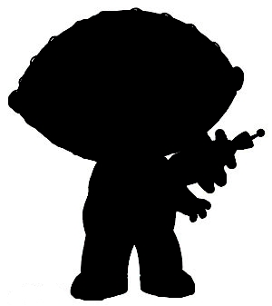

# STUI
**S**imple **T**ext-based **UI** Library

  

A curses wrapper that provides a few widgets/controls and is focused on 
providing a simple API. Example code/program can be found in `src/main.cpp`.

### Todo
- Window split / Multi-column 
- Create a test app so we can start tweaking the API
    - Text Editor / Notepad app
    - Calculator?
    - CSV/DB editor/viewer
- Form and input system

